# 🐍 贪学蛇 (StudiousSnake)

> 每天学习一点点，积累成大成就

一个现代化的个人学习记录与知识管理平台，帮助你建立良好的学习习惯，记录学习轨迹，管理知识内容。


## ✨ 核心功能

### 📚 学习项目管理

- 创建和管理多个学习项目
- 项目分类与标签系统
- 项目进度统计和可视化

### 📝 学习记录打卡

- 日历视图展示学习轨迹
- 每日学习笔记记录
- 学习时长统计
- Markdown 富文本编辑

### 📊 数据可视化

- 学习进度图表
- 打卡连续天数统计
- 学习效率分析
- 个人学习报告

### 🏷️ 知识内容管理

- 标签分类系统
- 多媒体内容支持
- 全局搜索功能

## 🎯 开发流程

本项目采用 **VibeSpecs** 现代化开发流程，确保高质量交付和风险可控：

### 📋 流程步骤

```mermaid
graph LR
    A[需求文档] --> B[AI 设计图]
    B --> C[AI 技术方案]
    C --> D[开发任务分解]
    D --> E[人工 Review]
    E --> F[逐步开发]
    F --> G[每步 Review]
    G --> H[完成交付]
```



### 🔄 详细流程

1. **📝 需求文档** - 明确项目目标和功能需求
2. **🎨 AI 设计图** - 自动生成界面设计和交互原型
3. **⚙️ AI 技术方案** - 智能制定技术架构和开发计划
4. **📋 开发任务分解** - 将复杂需求拆分为可管理的小任务
5. **👀 人工 Review** - 团队审核和修正技术方案
6. **🚀 逐步开发** - 按任务优先级有序开发
7. **✅ 每步 Review** - 每个里程碑进行质量检查
8. **🎉 完成交付** - 确保功能完整性和稳定性

### 🌟 流程优势

- **风险可控**: 每个步骤都有明确的检查点
- **质量保证**: 多重审核机制确保代码质量
- **效率提升**: AI 辅助减少重复性工作
- **团队协作**: 清晰的流程便于团队配合
- **持续改进**: 每个项目都能优化流程

## 🏗️ 技术架构

### 前端技术栈

- **框架**: Vue 3 + TypeScript + Composition API
- **构建工具**: Vite
- **UI 组件**: Naive UI
- **样式**: Tailwind CSS
- **状态管理**: Pinia
- **路由**: Vue Router 4
- **图表**: ECharts
- **工具库**: Axios, Day.js, Marked

### 后端技术栈

- **框架**: NestJS + TypeScript
- **数据库**: SQLite (开发) / PostgreSQL (生产)
- **ORM**: Prisma
- **认证**: JWT + Passport
- **密码加密**: bcrypt
- **API 文档**: Swagger
- **数据验证**: class-validator

### 数据库设计

```sql
-- 用户表
users (id, email, username, password, created_at, updated_at)

-- 学习项目表
projects (id, name, icon, description, cover_image, user_id, created_at, updated_at)

-- 学习记录表
records (id, project_id, user_id, date, duration, content, tags, created_at, updated_at)
```

## 🚀 快速开始

### 环境要求

- Node.js >= 18.0.0
- Yarn >= 1.22.0
- SQLite (开发环境)

### 安装依赖

```bash
# 克隆项目
git clone https://github.com/your-username/StudiousSnake.git
cd StudiousSnake

# 安装前端依赖
cd fe
yarn install

# 安装后端依赖
cd ../service
yarn install
```

### 开发环境启动

```bash
# 启动后端服务 (端口: 3000)
cd service
yarn start:dev

# 启动前端服务 (端口: 5173)
cd fe
yarn dev
```

### 数据库初始化

```bash
# 生成 Prisma 客户端
cd service
yarn db:generate

# 推送数据库结构
yarn db:push

# 查看数据库 (可选)
yarn db:studio
```

## 📱 项目结构

```
StudiousSnake/
├── fe/                    # 前端项目
│   ├── src/
│   │   ├── components/    # 通用组件
│   │   ├── views/         # 页面组件
│   │   ├── stores/        # Pinia 状态管理
│   │   ├── router/        # 路由配置
│   │   ├── types/         # TypeScript 类型定义
│   │   └── utils/         # 工具函数
│   ├── public/            # 静态资源
│   └── package.json
├── service/               # 后端项目
│   ├── src/
│   │   ├── auth/          # 认证模块
│   │   ├── projects/      # 项目管理
│   │   ├── records/       # 学习记录
│   │   ├── users/         # 用户管理
│   │   ├── prisma/        # 数据库服务
│   │   └── common/         # 通用模块
│   ├── prisma/            # 数据库配置
│   └── package.json
└── docs/                  # 项目文档 (VibeSpecs 流程产出)
    ├── api-spec.md        # API 接口规范
    ├── architecture.md    # 系统架构设计
    ├── tech-spec.md       # 技术方案文档
    ├── dev-tasks.md       # 开发任务分解
    └── study-tracker.html # 学习记录原型
```

## 🔧 开发指南

### VibeSpecs 流程实践

本项目严格按照 VibeSpecs 流程进行开发，确保每个功能都有完整的文档支撑：

- **需求阶段**: 参考 `docs/api-spec.md` 了解功能需求
- **设计阶段**: 查看 `docs/architecture.md` 理解系统架构
- **开发阶段**: 按照 `docs/dev-tasks.md` 执行具体任务
- **技术参考**: 使用 `docs/tech-spec.md` 作为技术实现指南

### 代码规范

- 使用 TypeScript 严格模式
- ESLint + Prettier 代码格式化
- 遵循 Vue 3 Composition API 最佳实践
- 使用语义化的 Git 提交信息

### API 接口

- RESTful API 设计
- JWT 身份认证
- 统一错误处理
- Swagger API 文档

### 数据库操作

```bash
# 生成 Prisma 客户端
yarn db:generate

# 创建数据库迁移
yarn db:migrate

# 重置数据库
yarn db:push --force-reset
```

## 📊 功能特性

### 已实现功能 ✅

- [x] 用户注册/登录/登出
- [x] 学习项目管理
- [x] 学习记录创建/编辑/删除
- [x] 日历视图展示
- [x] Markdown 编辑器
- [x] 标签系统
- [x] 响应式设计

### 计划功能 🚧

- [ ] 数据统计图表
- [ ] 学习目标设定
- [ ] 提醒功能
- [ ] 数据导出
- [ ] 文件上传
- [ ] 搜索功能

### 未来规划 🔮

- [ ] 团队协作
- [ ] 知识图谱
- [ ] AI 学习建议
- [ ] 移动端 App
- [ ] 离线支持

## 🎨 界面预览

### 主要页面

- **首页**: 项目列表和概览
- **项目详情**: 日历视图和学习记录
- **记录编辑**: Markdown 编辑器
- **统计页面**: 数据可视化

### 设计特色

- 简洁现代的 UI 设计
- 响应式布局适配
- 主题色: `#00ce33` (绿色)
- 支持深色模式 (计划中)

## 🔒 安全特性

- JWT Token 认证
- 密码加密存储
- 输入数据验证
- SQL 注入防护
- XSS 攻击防护
- CSRF 防护

## 📈 性能优化

### 前端优化

- 代码分割 (Code Splitting)
- 懒加载 (Lazy Loading)
- 图片压缩与懒加载
- 缓存策略

### 后端优化

- 数据库索引优化
- 查询性能优化
- 连接池管理
- 异步处理

## 🚀 部署指南

### 开发环境

```bash
# 前端开发服务器
cd fe && yarn dev

# 后端开发服务器
cd service && yarn start:dev
```

### 生产环境

- **前端**: Vercel / Netlify
- **后端**: Railway / Heroku
- **数据库**: PostgreSQL
- **文件存储**: AWS S3 / 阿里云 OSS

## 🤝 贡献指南

1. Fork 本仓库
2. 创建特性分支 (`git checkout -b feature/AmazingFeature`)
3. 提交更改 (`git commit -m 'Add some AmazingFeature'`)
4. 推送到分支 (`git push origin feature/AmazingFeature`)
5. 打开 Pull Request

## 📄 许可证

本项目采用 MIT 许可证 - 查看 [LICENSE](LICENSE) 文件了解详情。

## 📞 联系方式

- 项目链接: [https://github.com/your-username/StudiousSnake](https://github.com/your-username/StudiousSnake)
- 问题反馈: [Issues](https://github.com/your-username/StudiousSnake/issues)
- 邮箱: your-email@example.com

## 🙏 致谢

### 开发流程

感谢 **VibeSpecs** 现代化开发流程，让项目开发更加高效和可控。

### 开源项目

感谢以下开源项目的支持：

- [Vue.js](https://vuejs.org/) - 渐进式前端框架
- [NestJS](https://nestjs.com/) - 企业级 Node.js 框架
- [Prisma](https://www.prisma.io/) - 现代化数据库工具
- [Naive UI](https://www.naiveui.com/) - Vue 3 组件库
- [Tailwind CSS](https://tailwindcss.com/) - 实用优先的 CSS 框架

---

⭐ 如果这个项目对你有帮助，请给它一个星标！
